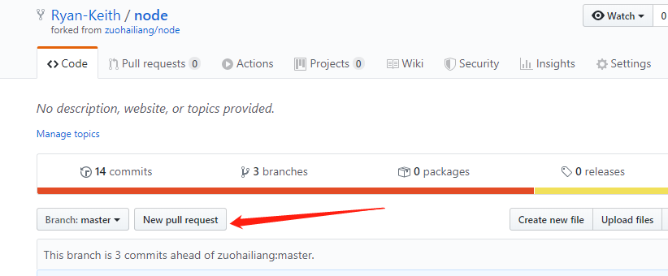
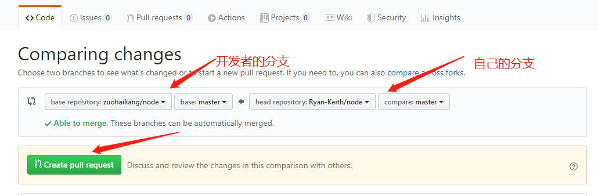
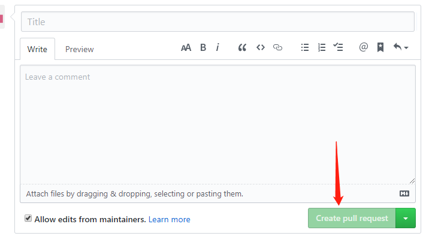

## 单人模式
整个git受控的文件夹构成一个版本库。文件在版本库中存在三个阶段，工作区（working directory）是我们在当前仓库中直接打开文件时能看到的版本；版本库（repository）是当前版本库与其他版本库交流（pull，push）时使用的版本。


### 增量模式
初始化git仓库
```shell
$git init
Initialized empty Git repository in /home/peta/USER/liujilong/git_learn/original_repository/virtual_project/.git/
```
`git add [path...]`用于从工作区向暂存区提交修改，`git commit`用于从暂存区向版本库提交修改。
```shell
$echo "This line will be the first commit." >readme
$git add readme
$git commit -m "first commit"

$echo "This line will be the second commit." >> readme
$git add readme
$git commit -m "second commit"

$echo "This line will be staged but not commited." >> readme
$git add readme

$echo "This line just modified in the workong directory." >>readme
```

增量操作结束，此时readme文件中的内容为：
```shell
$cat readme
This line will be the first commit.
This line will be the second commit.
This line will be staged but not commited.
This line just modified in the workong directory.
```
查看git仓库状态，readme中同时存在未暂存和未提交的修改。
```shell
$git status
On branch master
Changes to be committed:
  (use "git restore --staged <file>..." to unstage)
	modified:   readme

Changes not staged for commit:
  (use "git add <file>..." to update what will be committed)
  (use "git restore <file>..." to discard changes in working directory)
	modified:   readme
```
查看git仓库历史，共提交了两个版本。根据提交的时间自动维护顺序，最后一次的提交为HEAD，倒数第二次为HEAD^
```shell
$git log
commit c03032e5403cf4b96e30d217e0c39d19d9e92ad1 (HEAD -> master)
Author: wangyujue1 <wangyujue1@genomics.cn>
Date:   Thu Nov 28 16:07:28 2019 +0800

    second commit

commit 417709fbbc5b3d1f70d24efa2b54edc7f6d3cdbb
Author: wangyujue1 <wangyujue1@genomics.cn>
Date:   Thu Nov 28 16:06:22 2019 +0800

    first commit
```
### 改动查看
工作区与暂存区：
```shell
$git diff readme
diff --git a/readme b/readme
index 7d4a151..7010dbf 100644
--- a/readme
+++ b/readme
@@ -1,3 +1,4 @@
 This line will be the first commit.
 This line will be the second commit.
 This line will be staged but not commited.
+This line just modified in the workong directory.
```
暂存区与版本库：
```shell
$git diff --cached readme
diff --git a/readme b/readme
index 741db84..7d4a151 100644
--- a/readme
+++ b/readme
@@ -1,2 +1,3 @@
 This line will be the first commit.
 This line will be the second commit.
+This line will be staged but not commited.
```
工作区与版本库，哈希值可由HEAD代替：
```shell
$git diff c03032e5403c readme
diff --git a/readme b/readme
index 741db84..7010dbf 100644
--- a/readme
+++ b/readme
@@ -1,2 +1,4 @@
 This line will be the first commit.
 This line will be the second commit.
+This line will be staged but not commited.
+This line just modified in the workong directory.
```
版本库之间：
```shell
$git diff HEAD HEAD^ readme
diff --git a/readme b/readme
index 741db84..9f3fc90 100644
--- a/readme
+++ b/readme
@@ -1,2 +1 @@
 This line will be the first commit.
-This line will be the second commit.
```

### 后向模式
#### 版本库到暂存区
`git reset <commit>`用于从版本库向暂存区还原数据，会覆盖并丢弃掉未提交的暂存区修改，但不会对工作区产生影响。因此，此时通过`git status`查看状态，暂存区干净，与版本库一致，但工作区中存在未暂存的文件改动。查看readme文件，仍为最初工作区中的文件。
```shell
$git reset HEAD^
Unstaged changes after reset:
M	readme

$git status
On branch master
Changes not staged for commit:
  (use "git add <file>..." to update what will be committed)
  (use "git restore <file>..." to discard changes in working directory)
	modified:   readme

no changes added to commit (use "git add" and/or "git commit -a")

$git diff
diff --git a/readme b/readme
index 9f3fc90..7010dbf 100644
--- a/readme
+++ b/readme
@@ -1 +1,4 @@
 This line will be the first commit.
+This line will be the second commit.
+This line will be staged but not commited.
+This line just modified in the workong directory.
```
当指定的的commit版本号非当前HEAD时，同时产生版本库中的回滚操作。此时查看提交历史可以看到，第二次的提交记录不见了。
```shell
$git log
commit 417709fbbc5b3d1f70d24efa2b54edc7f6d3cdbb (HEAD -> master)
Author: wangyujue1 <wangyujue1@genomics.cn>
Date:   Thu Nov 28 16:06:22 2019 +0800

    first commit
```
#### 暂存区到工作区
`git restore <path...>`用于从暂存区向工作区还原文件改动，与版本库无关。工作区中的文件内容与版本库（暂存区）一致。
```shell
$git restore readme

$git status
On branch master
nothing to commit, working tree clean

$cat readme
This line will be the first commit.
```
### git受控文件范围

## 多人协作
多人共同完成一个项目时，每人维护一个分布式版本库。通过`git push`和`git pull`分别向目标版本仓库推送来拉回版本。
### 用户环境变量

git版本库用于标识用户的变量有`user.name`和`user.email`。使用`git config user.name "Jilong Liu"`和`git config user.email "liujilong@genomics.cn"`分别设置。当以上命令添加`--golbal`选项时为git的全局变量，会对所有未设置局部变量的项目起作用。

使用`git config --list`可以查看当前设置：
```shell
$git config --list
http.sslverify=true
http.sslcapath=/home/peta/anaconda3/ssl/cacert.pem
http.sslcainfo=/home/peta/anaconda3/ssl/cacert.pem
user.email=wangyujue1@genomics.cn
user.name=wangyujue1
core.repositoryformatversion=0
core.filemode=true
core.bare=false
core.logallrefupdates=true
receive.denycurrentbranch=warn
user.name=Jilong Liu
```

### 场景设置
保持前文单人场景下的增量模式完成时的版本库，记为Repo1，`git clone`复制Repo1，生成Repo2。 在Repo2中修改使得Repo2的结构为：
```shell
$cat readme
This line will be the first commit.
This line will be the second commit.
This line will be commit and push to another repository.
This line will be staged but not commit in the downstream.
This line will not be staged in the downstream.

$git status
On branch master
Changes to be committed:
  (use "git restore --staged <file>..." to unstage)
	modified:   readme

Changes not staged for commit:
  (use "git add <file>..." to update what will be committed)
  (use "git restore <file>..." to discard changes in working directory)
	modified:   readme

$git diff readme 
diff --git a/readme b/readme
index 6deb4b7..d83d8ae 100644
--- a/readme
+++ b/readme
@@ -2,3 +2,4 @@ This line will be the first commit.
 This line will be the second commit.
 This line will be commit and push to another repository.
 This line will be staged but not commit in the downstream.
+This line will not be staged in the downstream.

$git diff HEAD readme
diff --git a/readme b/readme
index e089083..d83d8ae 100644
--- a/readme
+++ b/readme
@@ -1,3 +1,5 @@
 This line will be the first commit.
 This line will be the second commit.
 This line will be commit and push to another repository.
+This line will be staged but not commit in the downstream.
+This line will not be staged in the downstream.
```

### 向目标版本库递交
向目标版本库递交当前版本库成功的前提是当前版本库的commit列表必须包含目标版本库中的所有commit并领先于目标版本库。
```shell
$git push --set-upstream /home/peta/USER/liujilong/git_learn/copyed_original_repository/virtual_project master
Enumerating objects: 10, done.
Counting objects: 100% (10/10), done.
Delta compression using up to 8 threads
Compressing objects: 100% (4/4), done.
Writing objects: 100% (6/6), 564 bytes | 564.00 KiB/s, done.
Total 6 (delta 1), reused 0 (delta 0)
remote: warning: updating the current branch
To /home/peta/USER/liujilong/git_learn/copyed_original_repository/virtual_project
   c03032e..2a89d14  master -> master
Branch 'master' set up to track remote branch 'master' from '/home/peta/USER/liujilong/git_learn/copyed_original_repository/virtual_project'.
```
此时Repo1的结构为：
```shell
$cat readme
This line will be the first commit.
This line will be the second commit.
This line will be staged but not commited.
This line just modified in the workong directory.

$git status readme
On branch master
Changes to be committed:
  (use "git restore --staged <file>..." to unstage)
	modified:   readme

Changes not staged for commit:
  (use "git add <file>..." to update what will be committed)
  (use "git restore <file>..." to discard changes in working directory)
	modified:   readme

$git diff readme
diff --git a/readme b/readme
index 7d4a151..7010dbf 100644
--- a/readme
+++ b/readme
@@ -1,3 +1,4 @@
 This line will be the first commit.
 This line will be the second commit.
 This line will be staged but not commited.
+This line just modified in the workong directory.

$git diff HEAD readme
diff --git a/readme b/readme
index e089083..7010dbf 100644
--- a/readme
+++ b/readme
@@ -1,3 +1,4 @@
 This line will be the first commit.
 This line will be the second commit.
-This line will be commit and push to another repository.
+This line will be staged but not commited.
+This line just modified in the workong directory.
```

### 向项目负责人pull-request
项目负责人定义为开发者，协作开发人定义为贡献者，实现多人协作开发，操作流程如下：
第一步：从开发者的远程仓库（以github为例）fork当前代码仓库，这时在自己的github上将会生成一个一模一样的项目，此项目包含开发者所有的代码提交版本，在本地clone自己远程仓库的fork下来项目
```shell
$ git init
Initialized empty Git repository in E:/mynode/.git/
$ git clone https://github.com/Ryan-Keith/node.git（自己本地仓库项目地址）
Cloning into 'node'...
remote: Enumerating objects: 17, done.
remote: Counting objects: 100% (17/17), done.
remote: Compressing objects: 100% (11/11), done.
remote: Total 17 (delta 4), reused 15 (delta 2), pack-reused 0
Unpacking objects: 100% (17/17), done.
```
第二步：由于是fork下来的项目，在使用git clone到本地时，这个时候的remote其实是原项目的地址，这时需要做的是删除原项目（开发者）地址的链接，git remote remove origin，这样就切断了原远程连接，接下来需要做的是建立一个新的远程仓库（这个仓库是自己的github仓库，而非开发者的），这里建议使用ssh key重新建立连接
```shell
$ git remote rm origin
git remote add other git@github.com:Ryan-Keith/node.git
$ git remote -v
other   git@github.com:Ryan-Keith/node.git (fetch)
other   git@github.com:Ryan-Keith/node.git (push)
```
第三步：修改或添加文件，git push最新版本到自己的远程仓库，进入自己fork下的项目地址，找到new pull request按钮，如下图：

进入之后，如图选择，有Base 和 Head 两个选项。Base 是你希望提交变更的目标，Head 是目前包含你的变更的那个分支或仓库。

填写说明，帮助别人理解你的提交，然后按下"create pull request"按钮即可。
PR 创建后，管理者就要决定是否接受该 PR


### 从目标版本库拉回
开发者受理了你的pull-request请求，更新完后，贡献者从他的远程仓库pull更新，首先贡献者在本地与开发者建立远程连接，
git remote add <name> <开发者远程地址>
建立完链接后git pull <name> <开发者分支>

## 补充

### man help

### diff结果理解
Index: 两个版本的git hash value\
100表示普通文件，644是linux的权限代码\
--- +++分别标识的文件\
@@表示文件变动描述合并显示的开始和结束，一般在变动前后多显示3行，其中-+表示变动前后，逗号前是起始行位置，逗号后为从起始行往后几行。\
变动内容 ——+表示增加了这一行，-表示删除了这一行，没符号表示此行没有变动。

### 分布式的思考
git是分布式版本管理系统，svn为中心化版本管理系统。svn在客户端不维护版本，客户端的改动均需提交到服务器端后才进行受控，也只能从服务器端拉回其他人的修改。git在本地维护版本库，版本库可自由复制，同个项目的不同版本库之间地位相同，当前版本库可向任意其他版本库推送、从其他任意版本库拉回修改。github等远程仓库存在的意义仅为方便交换。

### git文件受控范围
test test test
